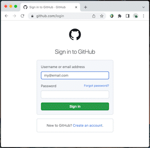

<p align="center">

<h3 align="center">TurtlPass Chrome Extension</h3>
<p align="center">
TurtlPass Chrome Extension sends a hash of the user's inputs (Domain, Account ID, and PIN) to the TurtlPass Firmware via USB. When the physical button on the device is pressed, the firmware emulates an external keyboard and types the password. This method ensures that the password is never transmitted over potentially insecure channels, providing an additional layer of security.
</p>
<p align="center">
<a href="https://github.com/TurtlPass/turtlpass-chrome-extension/releases"></a>
</p>
<p align="center">
<a href="https://github.com/TurtlPass/turtlpass-firmware-arduino"></a>
<a href="https://github.com/TurtlPass/turtlpass-android"></a>
</p>


## ⚡ Features

* Generate strong, secure passwords using the TurtlPass Firmware
* Automatically populate the `Domain` based on active tab
* No need to re-enter your `Account ID` every time
* Press `Ctrl` to quickly and easily reveal or hide your password
* Keep your online accounts safe and secure with TurtlPass!


## 🔑 How to Use



1. Go to a Login Web page
    * For example: https://github.com/login
2. Click on this Chrome extension icon and a popup will open with the current domain auto-filled
3. Fill in the `User ID` input with an email address, for example.
    * Next time this field will be auto-populated with this value.
4. Click `Unlock`
5. Type your 6 digits `PIN`
5. Choose _TurtlPass_ device from the popup and click **Connect**
6. The TurtlPass extension closes automatically on Success

👉 **Now, by pressing the hardware button of the device it starts typing the password in the current input field with focus.**


## 🔧 Installation

1. [Download](https://github.com/TurtlPass/turtlpass-chrome-extension/archive/refs/tags/1.0.0.zip) this repository to your computer
2. Go to the **Chrome extensions** page: `chrome://extensions`
3. Turn on **Developer mode**
4. Add the extension by clicking **Load Unpacked** button and selecting the downloaded folder
5. Done - you 
6. can start using it!

## 🌐 Supported Browsers

| [Google Chrome](https://www.google.com/chrome) | [Gener8](https://gener8ads.com/products/browser) |
| :-----------: | :----------: |
| Supported ✅  | Supported ✅ |

This extension is **not** compatible with:

- Mozilla Firefox
- Brave
- Opera
- Safari


### 🙋 Troubleshoot

If you can't connect, try turn on the serial port connection feature in Chrome:

```
chrome://flags/#enable-experimental-web-platform-features
```


## 📚 APIs & Libraries

* [Web Serial API](https://web.dev/serial/)
* [Lottie Web](https://github.com/airbnb/lottie-web)
* [Material Design UI components for the web](https://github.com/material-components/material-components-web)
* [SHA-512](http://pajhome.org.uk/crypt/)
* [Argon2](https://github.com/antelle/argon2-browser)


## 📦 Sources

* [Load Wasm in manifest-v3](https://groups.google.com/a/chromium.org/g/chromium-extensions/c/sJiaTnFMLHQ/m/y-qT1gplHwAJ)
* [Load favicon images](https://stackoverflow.com/a/15750809/904907)
* [UI of PIN input](https://codepen.io/bradeneast/pen/YzzMoGw)
* [USB Memory Stick Animation](https://lottiefiles.com/20358-usb-memory-stick-animation)
* [Loading/Success/Error Animation](https://lottiefiles.com/627-loading-success-failed)


## 🔮 Future improvements

- Read NFC Tag ID with an external reader via USB serial (optional input)


## 📄 License

TurtlPass Chrome Extension is released under the [MIT License](https://github.com/TurtlPass/turtlpass-chrome-extension/blob/main/LICENSE).
